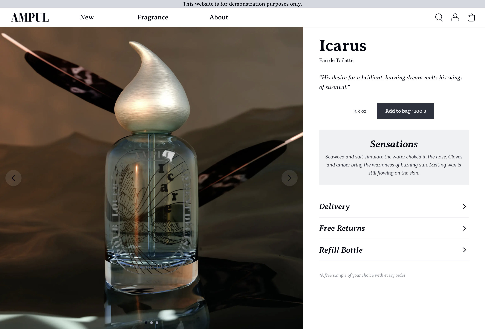
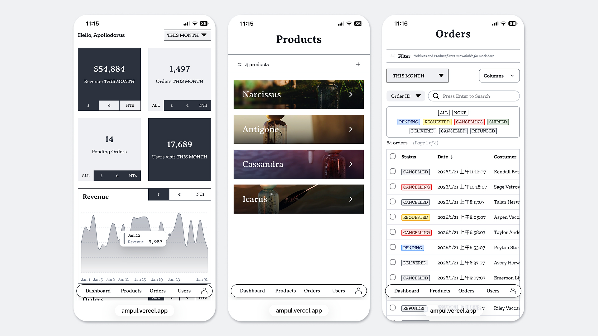

# AMPUL - A full-stack e-commerce brand website

A full-stack e-commerce website for a fictional fragrance brand, featuring interactive 3D product visualization, multi-language support, and a complete admin dashboard.


## Link

[Live Demo](https://ampul.vercel.app)

[Admin Dashboard](https://ampul.vercel.app/admin)

[Behance](https://www.behance.net/gallery/242458065/AMPUL-A-concept-driven-digital-experience)

## About

AMPUL is a fictional fragrance brand inspired by the concept of ampoules—small vessels preserving what remains of a life. The website delivers a consistent experience from concept and product to UI/UX.

## Tech Stack

| Category | Technologies |
|----------|-------------|
| **Framework** | Next.js 15, React 19, TypeScript |
| **Database** | PostgreSQL, Prisma ORM |
| **Styling** | Tailwind CSS 4 |
| **3D Graphics** | Three.js, React Three Fiber |
| **Animation** | Framer Motion |
| **Authentication** | Auth.js (OAuth) |
| **UI Components** | Hand-crafted components, shadcn/ui |
| **i18n** | next-intl (EN, FR, ZH-TW) |

## Key Features

### Customer-Facing
- **Interactive 3D Bottle Viewer** - Explore products with auto-rotating 3D models built with Three.js
- **Multi-Language Support** - Full internationalization for English, French, and Traditional Chinese
- **Responsive Design** - Mobile-first approach with distinct mobile/desktop experiences
- **Multi-Step Checkout** - Animated checkout flow with address validation and locale-specific formatting

### Admin Dashboard
- **Analytics Dashboard** - Revenue and order charts with Recharts
- **Order Management** - Track orders, update shipping status and order lifecycle
- **Product Management** - CRUD operations for products, categories, collections, and tags

## Technical Highlights

### Internationalization Architecture
Implemented a comprehensive i18n system featuring:
- URL-based locale routing (`/us`, `/fr`, `/tw`)
- Server-side locale resolution with fallbacks
- Database-level locale mapping for product translations
- Middleware-based automatic language detection
- Locale-specific font override for CJK support

### Authentication & Authorization
- OAuth integration with Google provider via NextAuth.js
- Role-based access control (admin/user)
- Mock data in admin for visitors (no login required to explore)
- Login tracking with throttling

### Performance Optimizations
- Dynamic imports for Three.js to reduce initial bundle
- Server Components for data fetching
- LazyMotion for optimized animations

## Project Structure

```
src/
├── app/                    # Next.js App Router
│   ├── [locale]/          # Locale-prefixed routes
│   │   ├── p/             # Product pages
│   │   ├── c/             # Collection pages (List of products in Collection)
│   │   ├── e/             # Event pages
│   │   ├── checkout/      # Checkout flow
│   │   └── u/             # User profile & orders
│   ├── admin/             # Admin dashboard
│   │   ├── p/             # Product management page
│   │   ├── c/             # Collection management page
│   │   ├── props/         # Properties(Category & Tag of product) management page
│   │   ├── o/             # Order management page
│   │   └── u/             # User management page
│   ├── api/               # API routes
│   └── actions/           # Server actions
├── components/            # React components
│   ├── home/              # Landing page (3D viewer, carousel)
│   ├── product/           # Product components
│   ├── admin/             # Admin UI
│   ├── modal/             # Pop-up Modal
│   ├── providers/         # Providers
│   ├── shadcn/            # Components from shadcn
│   └── common/            # Shared components
├── lib/                   # Utilities & Prisma client
├── i18n/                  # Internationalization config
└── messages/              # Translation files (EN, FR, ZH-TW)
```

## Getting Started

### Prerequisites
- Node.js 18+
- PostgreSQL database
- Google OAuth credentials (for authentication)

### Installation

```bash
# Clone the repository
git clone https://github.com/yourusername/ampul-web.git
cd ampul-web

# Install dependencies
npm install

# Set up environment variables
cp .env.example .env.local
# Edit .env.local with your database URL and OAuth credentials

# Run database migrations
npx prisma migrate dev

# Start development server
npm run dev
```

Open [http://localhost:3000](http://localhost:3000) to view the application.

## Screenshots

### Homepage


### Product Page


### 3D Bottle Viewer


### Admin Dashboard



## License

This project is licensed under the MIT License - see the [LICENSE](LICENSE) file for details.
