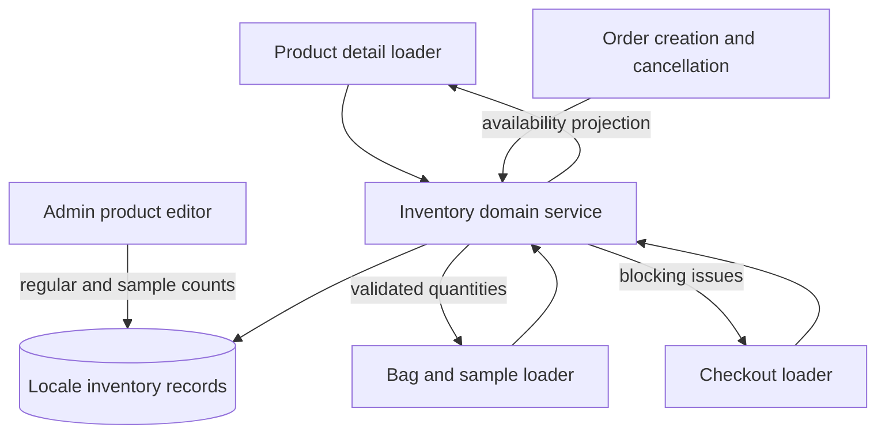
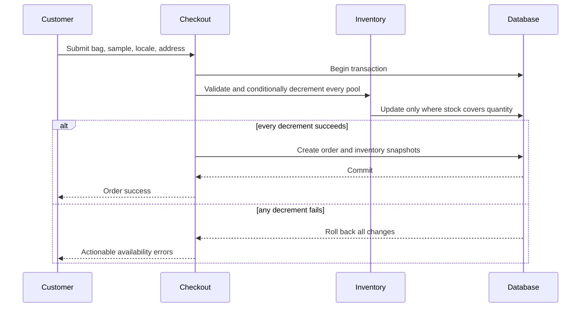
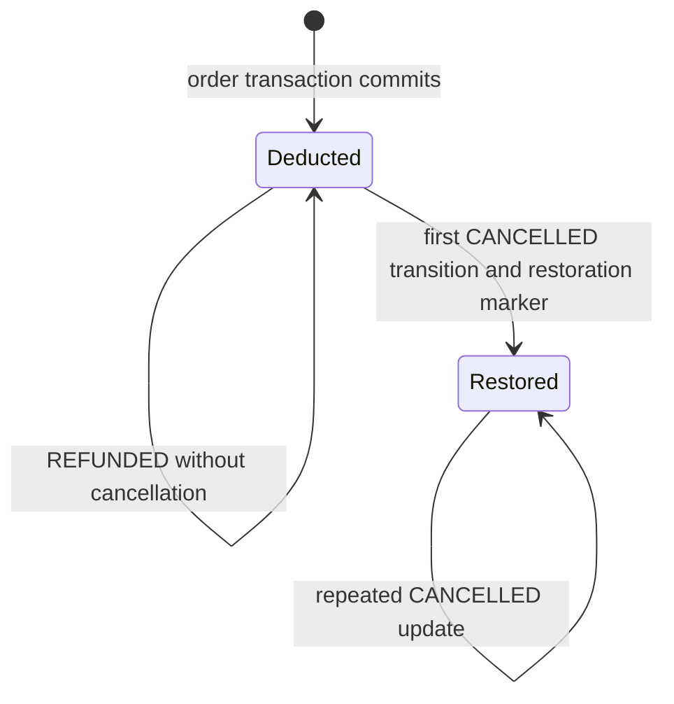

# Locale Inventory System - Plan

## Goal Capsule

- **Objective:** Prevent orders from exceeding the inventory assigned to the shopper's active locale while keeping stock feedback understandable throughout shopping.
- **Product authority:** This Product Contract defines inventory behavior for purchasable volumes, free samples, bags, checkout, order creation, cancellation, and product administration.
- **Open blockers:** None.

---

## Product Contract

### Summary

Add locale-specific inventory for purchasable product volumes and free samples, expose clear availability states to customers, and make order creation the atomic source of truth for stock deduction.

### Problem Frame

Product volumes already carry locale-specific price and optional stock data, but the storefront does not enforce that stock across shopping and checkout. A local bag can therefore retain unavailable quantities, concurrent orders can oversell the final units, and free samples have no inventory representation because they are recorded without a volume.

### Actors

- A1. A storefront customer shopping in the `us`, `fr`, or `tw` locale.
- A2. An administrator maintaining regular and sample inventory by locale.
- A3. The order workflow responsible for deducting and restoring inventory.

### Requirements

**Inventory ownership**

- R1. Each purchasable product-volume combination has an independent inventory count for each supported locale.
- R2. Each product offered as a free sample has an independent sample inventory count for each supported locale, separate from sellable volume inventory.
- R3. Existing regular inventory initializes to 30, new inventory is required, and missing inventory is treated as zero rather than unlimited.
- R4. Inventory never falls back across locales; missing inventory in the active locale makes that item unavailable there.

**Customer availability**

- R5. Regular items expose three availability states: `Out of stock` at zero, `Only {count} left in stock` from 1 through 10, and `In stock` above 10.
- R6. Availability is refreshed when product information loads, an item is added or changed in the bag, the bag opens, and checkout loads.
- R7. Bag quantities cannot be increased beyond current locale inventory, but earlier checks do not reserve stock.
- R8. Items made unavailable by a locale switch or later stock change remain visible in the bag, block checkout, and require removal or quantity reduction.
- R9. Out-of-stock samples remain visible in sample selection but are gray and disabled.
- R10. If a selected sample becomes unavailable, its selection is cleared, the customer is informed, and another available sample must be chosen.

**Order lifecycle**

- R11. Final order submission atomically validates and deducts regular and selected sample inventory in the active locale before creating the order.
- R12. If any requested quantity is unavailable at final submission, no order is created, no inventory is deducted, and the customer receives actionable stock feedback.
- R13. A successful order deducts regular quantities and one unit of the selected sample; the bag itself never reserves inventory.
- R14. The first transition of an order to `CANCELLED` restores every regular and sample quantity once; refund alone does not restore inventory.

**Administration**

- R15. Product administration provides locale-specific regular inventory controls beside the existing per-volume price controls.
- R16. Product administration provides locale-specific sample inventory controls without representing samples as a sellable volume.
- R17. Administrators can set inventory to any whole number from zero through the supported maximum and see validation errors for invalid values.

### Key Flows

- F1. Shop and add an available item
  - **Trigger:** A1 loads a product and selects a volume.
  - **Steps:** The storefront shows the active locale's stock state; adding or increasing quantity checks current availability; the bag retains the accepted quantity.
  - **Outcome:** The bag never knowingly exceeds the most recently checked stock, without reserving it.
  - **Covered by:** R4-R8.
- F2. Complete an order
  - **Trigger:** A1 submits the final checkout step.
  - **Steps:** The order workflow revalidates all regular items and the selected sample, atomically deducts stock, and creates the order only if every deduction succeeds.
  - **Outcome:** Concurrent submissions cannot oversell inventory.
  - **Covered by:** R11-R13.
- F3. Recover from changed availability
  - **Trigger:** A bag item or selected sample is no longer available in the active locale.
  - **Steps:** The item remains visible with an actionable state; invalid sample selection is cleared; checkout stays blocked until the customer resolves the issue.
  - **Outcome:** No item is silently removed or replaced.
  - **Covered by:** R8-R10, R12.
- F4. Cancel an order
  - **Trigger:** A3 changes an eligible order to `CANCELLED`.
  - **Steps:** The workflow restores the quantities originally deducted, including a selected sample, and records that restoration through the order state transition.
  - **Outcome:** Repeated cancellation handling cannot increase inventory twice.
  - **Covered by:** R14.

### Acceptance Examples

- AE1. **Covers R5.** Given locale inventory of 11, when a customer views the volume, then the page says `In stock` without exposing 11.
- AE2. **Covers R5.** Given locale inventory of 10, when a customer views the volume, then the page says `Only 10 left in stock`.
- AE3. **Covers R4, R8.** Given an item available in `us` but unavailable in `fr`, when the customer switches to `fr`, then the item remains visible, is marked unavailable, and blocks checkout.
- AE4. **Covers R9-R10.** Given a selected sample whose locale inventory becomes zero, when availability refreshes, then the option remains visible but disabled, the selection is cleared, and the customer is informed.
- AE5. **Covers R11-R12.** Given two customers concurrently request the final unit, when both submit, then exactly one order deducts the unit and succeeds while the other order is rejected without a partial deduction.
- AE6. **Covers R14.** Given an order that deducted two regular units and one sample, when it first becomes cancelled, then all three units are restored; repeating cancellation handling restores nothing further.

### Scope Boundaries

- Inventory holds or checkout reservation expiry are not included.
- Exact inventory counts above the low-stock threshold are not customer-visible.
- Unavailable bag items and samples are not silently removed or automatically replaced.
- Refund status alone does not return inventory.
- Inventory forecasting, supplier management, low-stock notifications, and inventory audit reporting are deferred.

### Assumptions

- The low-stock threshold is fixed at 10 for this version.
- One order may receive at most one free sample under the existing checkout policy.
- Order creation represents checkout success in the current demo payment flow.

### Product Contract Preservation

Product Contract unchanged.

---

## Planning Contract

### Key Technical Decisions

- KTD1. **Keep regular inventory on `ProductVolume`.** Its compound identity already matches product, volume, and database locale; make `stock` required with a default of 30 and backfill existing null values before applying the constraint.
- KTD2. **Model sample inventory separately.** Add a product-and-locale sample inventory relation because samples consume physical units but have no sellable volume or price.
- KTD3. **Use strict inventory lookup with translation-only fallback.** Text and labels may continue falling back to `en-US`, but price and stock must come from the active database locale row or report unavailable.
- KTD4. **Centralize inventory projections and mutations.** A server-side inventory module owns availability classification, strict lookups, bag validation, atomic deduction, and restoration so each surface applies identical rules.
- KTD5. **Treat final order creation as one transaction.** Conditional stock updates, order and order-item creation, inventory identity snapshots, and the user's `lastOrderAt` update succeed or roll back together; email delivery remains a post-commit best-effort side effect.
- KTD6. **Snapshot restoration identity on order items.** Store the database locale and the regular volume identity used for deduction; `isFreeSample` distinguishes which pool to restore after a first transition to `CANCELLED`.
- KTD7. **Make cancellation restoration transition-based, atomic, and durable.** Record an order-level restoration timestamp inside the cancellation transaction and restore only while that marker is absent, so later status changes or concurrent cancellation requests cannot restock twice.
- KTD8. **Keep local bag state lightweight.** Continue storing only product ID, volume ID, and quantity in `localStorage`; server projections attach current stock state and permitted quantity whenever the bag is refreshed.

### High-Level Technical Design

The inventory service is the shared authority behind read-time feedback and write-time enforcement.

Order creation places all authoritative mutations inside one database transaction; a stale read can improve messaging but never authorizes purchase.

Cancellation restoration follows the order state transition, not repeated requests or refund status.

### Sequencing

1. Establish the database contract and migration before exposing editable counts.
2. Add the shared inventory domain behavior before wiring storefront consumers.
3. Integrate admin, product, bag, and checkout reads against that shared behavior.
4. Put atomic deduction into order creation, then add cancellation restoration using the persisted snapshots.
5. Complete translations, end-to-end scenarios, and migration verification after all surfaces agree on the contract.

### System-Wide Impact

- **Data lifecycle:** Inventory moves from nullable advisory data to required transactional state; deployment must apply and verify the backfill before code assumes non-null values.
- **Storefront:** Product selection, bag editing, sample selection, locale switching, and checkout submission gain unavailable and low-stock states.
- **Order operations:** Status changes become inventory-bearing operations, so all cancellation entry points must use the same restoration path.
- **Static rendering:** Product pages may be statically generated, but stock is volatile; interactive availability must be refreshable and cannot rely solely on build-time product data.
- **Failure handling:** Email sending remains non-blocking and outside the inventory transaction so delivery failures cannot undo a valid order or cause a retry to deduct twice.

### Risks and Mitigations

- **Migration drift:** Backfill null regular stock to 30, seed sample rows explicitly, and mark pre-feature orders as non-restorable because they never deducted inventory; verify all three invariants before enabling enforcement.
- **Overselling under concurrency:** Use conditional database updates inside one transaction and require the affected-row result to prove each decrement.
- **Partial deduction:** Abort the transaction when any regular or sample pool fails; never decrement sequentially outside the order transaction.
- **Duplicate restoration:** Gate restoration on the durable order restoration marker within the same transaction, not only the current status value.
- **Stale client state:** Treat product and bag checks as advisory; return structured availability failures from final submission and refresh affected UI state.
- **Locale fallback leakage:** Separate translation fallback helpers from inventory lookup helpers and cover missing-locale rows directly in tests.

---

## Implementation Units

### U1. Establish the inventory data contract and migration

- **Goal:** Make regular inventory required, add locale-specific sample inventory, and retain enough order-item identity for exact restoration.
- **Requirements:** R1-R4, R11-R14, R16; F2, F4; AE5-AE6.
- **Dependencies:** None.
- **Files:** `prisma/schema.prisma`, `prisma/migrations/<timestamp>_locale_inventory_system/migration.sql`, `src/generated/prisma/**`, `package.json`, `vitest.integration.config.mts`, `src/test/database.ts`, `src/lib/__tests__/inventory-schema.test.ts`.
- **Approach:** Change regular stock to a required integer with a default of 30, backfill existing null rows to 30 before the non-null constraint, and add database check constraints preventing negative regular and sample counts. Add a sample inventory relation keyed by product and locale, nullable order-item snapshot fields for database locale and volume identity, and a nullable order restoration timestamp. Seed one sample inventory row per existing product and supported locale at 30. Mark every pre-feature order as already handled for restoration because those orders did not deduct inventory under this system; newly created orders leave the marker null until cancellation restores them. Add a Node-environment Vitest integration configuration and isolated database helper so transaction and migration tests run against PostgreSQL rather than jsdom or mocks.
- **Execution note:** Verify the migration against representative pre-feature rows before relying on generated types.
- **Patterns to follow:** Compound locale identities used by `ProductVolume` and translation models in `prisma/schema.prisma`; generated Prisma client workflow in `package.json`.
- **Test scenarios:**
  - Existing `ProductVolume` rows with null stock migrate to 30 and satisfy the new required constraint.
  - Existing non-null stock values, including zero, remain unchanged.
  - Existing products receive sample stock of 30 for `en-US`, `fr-FR`, and `zh-TW` without duplicate compound keys.
  - New regular and sample inventory records reject negative values and duplicate identities at the database boundary.
  - Order items can snapshot regular locale and volume identity while free-sample items snapshot locale with no volume.
  - Existing orders receive the migration restoration marker and cannot add stock when cancelled after deployment.
- **Verification:** A migrated database contains no nullable regular stock, preserves zero and positive counts, has complete initial sample pools, and the generated client exposes the new relations and fields.

### U2. Build the shared inventory domain service

- **Goal:** Provide one server-side authority for stock states, strict locale resolution, bag validation, atomic deduction, and restoration.
- **Requirements:** R3-R14; F1-F4; AE1-AE6.
- **Dependencies:** U1.
- **Files:** `src/lib/inventory.ts`, `src/lib/inventory.test.ts`, `src/i18n/config.ts`.
- **Approach:** Centralize URL-to-database locale mapping, the fixed low-stock threshold, customer-facing availability projections, strict regular and sample lookups, quantity issue shapes, conditional decrements, and restoration helpers. Keep translated labels outside the domain service; return stable state and count data for callers to localize.
- **Execution note:** Implement transaction-critical behavior test-first, especially competing decrements and rollback semantics.
- **Patterns to follow:** Locale mapping in `src/i18n/config.ts`; Prisma singleton in `src/lib/prisma.ts`; serializable server-action result shapes in existing action modules.
- **Test scenarios:**
  - Covers AE1-AE2. Counts of 0, 1, 10, and 11 map to out-of-stock, exact low-stock, and in-stock states at the correct boundaries.
  - A missing active-locale regular row is unavailable even when `en-US` has stock.
  - A requested quantity equal to stock succeeds; one above stock returns the available count without mutation.
  - Covers AE5. Two competing decrements for the final unit yield one success and one availability failure.
  - A multi-item deduction where the last pool is short rolls back every earlier decrement.
  - Regular and sample deductions target distinct pools.
  - Covers AE6. Restoration returns original quantities once, including one sample, and a repeated cancellation transition is a no-op.
- **Verification:** Unit and database-backed integration coverage proves strict locale isolation, boundary states, atomic all-or-nothing mutation, and idempotent restoration.

### U3. Add locale inventory controls to product administration

- **Goal:** Let administrators edit regular stock beside volume prices and sample stock for the selected locale.
- **Requirements:** R1-R4, R15-R17; A2.
- **Dependencies:** U1, U2.
- **Files:** `src/app/admin/p/components.tsx`, `src/app/admin/p/ProductsClient.tsx`, `src/app/admin/p/actions.ts`, `src/app/admin/p/data.ts`, `src/app/admin/p/validation.ts`, `src/app/admin/p/__tests__/inventory-admin.test.tsx`.
- **Approach:** Extend the existing locale-tab form state so every selected volume carries a required whole-number stock field adjacent to price. Add a separate sample stock input for the selected locale, include both inventory types in create and update payloads, and persist all related rows transactionally with product edits.
- **Patterns to follow:** Existing per-locale `volumePrices` state and price row near the selected-volume price section; Zod limits and authenticated server actions in the same admin feature.
- **Test scenarios:**
  - Creating a product submits regular stock for every selected locale-volume pair and sample stock for every supported locale.
  - Editing one locale changes only that locale's regular and sample pools.
  - Zero is accepted and persists as out of stock; blank, fractional, negative, and above-maximum values show validation errors and block submission.
  - Adding a volume initializes its stock to 30 for each locale; removing a volume removes its associated regular inventory rows without changing sample inventory.
  - An unauthorized caller cannot change inventory.
- **Verification:** Admin create and edit flows round-trip regular and sample counts accurately for all locales, with invalid input rejected before persistence.

### U4. Surface live availability on product and bag flows

- **Goal:** Show current locale stock states, enforce quantity limits before checkout, and preserve unavailable bag entries across locale changes.
- **Requirements:** R4-R10; F1, F3; AE1-AE4.
- **Dependencies:** U2.
- **Files:** `src/app/[locale]/p/[slug]/data.ts`, `src/app/[locale]/p/[slug]/page.tsx`, `src/components/product/AddToBagButton.tsx`, `src/app/actions/inventory.ts`, `src/app/actions/shoppingBag.ts`, `src/components/providers/ShoppingBagProvider.tsx`, `src/components/modals/ShoppingBagModalWrapper.tsx`, `src/components/modals/ShoppingBagModal.tsx`, `src/components/product/__tests__/inventory-availability.test.tsx`, `src/components/modals/__tests__/shopping-bag-inventory.test.tsx`, `src/components/providers/__tests__/ShoppingBagProvider.test.ts`, `src/app/actions/__tests__/inventory-projection.test.ts`.
- **Approach:** Stop falling back regular price and stock rows across locales, project initial availability for each volume, then refresh volatile stock through a server action after hydration and on volume selection. Disable impossible adds and refresh bag server details when it opens or changes. Return unavailable items instead of filtering them out, clamp accepted quantities to current stock, disable checkout while issues exist, and return sample options with stock state so zero-stock choices stay visible but disabled.
- **Execution note:** Add characterization coverage for the current localStorage bag contract before extending its UI behavior.
- **Patterns to follow:** Server data loading in product detail data; ID-only bag persistence in `ShoppingBagProvider`; modal refresh orchestration in `ShoppingBagModalWrapper`.
- **Test scenarios:**
  - Covers AE1-AE2. Product volumes show the three stock messages and disable add-to-bag at zero.
  - Adding or increasing an item cannot exceed the current locale stock or the existing per-line cap of 10.
  - Covers AE3. Switching from a stocked locale to an unavailable locale retains the item, marks it unavailable, and disables checkout.
  - A stale bag quantity above stock remains visible and requires reduction to the reported maximum.
  - Covers AE4. Zero-stock sample options remain visible, gray, and disabled; a now-invalid selection is cleared with feedback.
  - Availability changes are announced to assistive technology, disabled sample options are not selectable by keyboard, and stock feedback is associated with the active volume control.
  - The default sample chooses the first in-stock option, and no default is selected when every sample is unavailable.
  - A bag refresh failure leaves checkout blocked rather than treating missing data as available.
- **Verification:** Product and bag tests demonstrate correct boundary text, strict locale behavior, retained invalid items, quantity correction, and accessible disabled sample options.

### U5. Revalidate inventory throughout checkout

- **Goal:** Prevent entry into final submission with stale bag or sample quantities and present actionable localized feedback.
- **Requirements:** R6, R8-R10, R12; F3; AE3-AE4.
- **Dependencies:** U2, U4.
- **Files:** `src/app/[locale]/checkout/page.tsx`, `src/app/actions/shoppingBag.ts`, `messages/en.json`, `messages/fr-FR.json`, `messages/zh-TW.json`, `src/app/[locale]/checkout/__tests__/checkout-inventory.test.tsx`.
- **Approach:** Reuse the server inventory projection when checkout loads and before enabling the last step. Keep invalid lines visible, clear unavailable sample selection, localize stock-state and resolution messages, and treat a refresh error as a blocking state with retry rather than allowing submission.
- **Patterns to follow:** Existing checkout step state, `next-intl` client translations, and locale-aware server actions.
- **Test scenarios:**
  - Checkout loads normally when every regular quantity and selected sample remains available.
  - An unavailable regular line or excess quantity blocks progression and identifies the item and available amount.
  - Covers AE4. A sold-out selected sample is cleared and checkout requests another available selection.
  - A locale switch while checkout is mounted refreshes against the new locale and does not use US inventory fallback.
  - Network or server validation failure blocks final submission and offers retry without deleting bag state.
  - English, French, and Traditional Chinese render every new stock and resolution key without missing-message errors.
- **Verification:** Checkout cannot reach a valid submission state with unresolved inventory issues, and each locale communicates the required correction.

### U6. Make order deduction and cancellation restoration atomic

- **Goal:** Guarantee that successful orders own their stock and cancelled orders restore it exactly once.
- **Requirements:** R11-R14; F2, F4; AE5-AE6.
- **Dependencies:** U1, U2, U5.
- **Files:** `src/app/actions/checkout.ts`, `src/app/admin/o/actions.ts`, `src/app/[locale]/u/orders/actions.ts`, `src/app/actions/__tests__/checkout-inventory.test.ts`, `src/app/admin/o/__tests__/order-inventory-restoration.test.ts`, `src/app/[locale]/u/orders/__tests__/order-cancellation-inventory.test.ts`.
- **Approach:** Move product resolution, authoritative price calculation, conditional regular and sample decrements, order creation, snapshot persistence, and `lastOrderAt` update into one Prisma transaction. Return structured availability failures rather than a generic order error. Route every cancellation action through one transition helper that restores from snapshots and sets the restoration timestamp in the same transaction; leave only email delivery after commit and ensure email failure cannot turn a committed order into a retryable checkout error.
- **Execution note:** Start with failing integration tests for competing final-unit orders, partial rollback, and duplicate cancellation requests.
- **Patterns to follow:** Existing checkout order snapshot fields and authenticated admin/user order actions; non-blocking email behavior after order creation.
- **Test scenarios:**
  - Covers F2 / AE5. Two concurrent final-unit orders produce one committed order and one stock failure with stock ending at zero.
  - A request containing one available and one unavailable item creates no order and changes no stock.
  - A selected sample that sells out after checkout validation rejects final submission without deducting regular items.
  - Server-side totals use current locale prices and ignore client-supplied presentation data.
  - Covers F4 / AE6. First cancellation restores each regular quantity and one sample to their original locale pools.
  - Repeating or concurrently requesting cancellation cannot restore twice.
  - Moving a restored order away from `CANCELLED` and back again does not restore twice because the restoration marker remains set.
  - Changing an order to `REFUNDED` without a cancellation does not restore stock.
  - A failed email send after commit does not roll back inventory or create a second deduction on response handling.
- **Verification:** Database-backed tests prove all-or-nothing order creation, no oversell, exact snapshot restoration, and idempotent cancellation across admin and customer entry points.

---

## Operational and Rollout Notes

- Take a database backup or verified restore point before applying the migration because it changes inventory semantics and seeds new rows.
- Deploy the migration before application code that assumes required stock or sample inventory. The migration must finish its backfill and invariant checks before adding the non-null regular-stock constraint.
- If validation fails before application rollout, roll back the schema additions and seeded sample rows while restoring the prior nullable stock definition. After new orders begin deducting inventory, prefer a corrective roll-forward; reverting application code alone would lose the authority needed to restore those deductions.
- Record migration counts for regular rows backfilled, sample rows seeded, and legacy orders marked non-restorable, then compare them with pre-migration source counts.

---

## Verification Contract

| Gate | Applies to | Verification | Done signal |
|---|---|---|---|
| Prisma generation | U1 | `npx prisma generate` | Generated client matches required regular stock, sample inventory, and order snapshot fields. |
| Migration proof | U1 | Apply the migration to a database fixture containing null, zero, and positive stock plus legacy orders | Null becomes 30, zero and positive values remain unchanged, sample rows are complete, and legacy orders cannot later create stock. |
| Focused UI and domain tests | U2-U5 | `npm test -- --run` with the non-database inventory test paths from each unit | All boundary, rendering, bag, and checkout scenarios pass. |
| PostgreSQL integration tests | U1, U2, U6 | `npx vitest run --config vitest.integration.config.mts` against an isolated test database | Migration, competing decrement, rollback, and restoration scenarios pass against PostgreSQL. |
| Type and lint gates | U1-U6 | `npx tsc --noEmit` and `npm run lint` | No TypeScript or lint regressions. |
| Production build | U3-U6 | `npx next build` after migration verification | Locale-prefixed storefront and admin routes compile successfully without coupling the compile check to another migration deployment. |
| Manual browser QA | U3-U6 | Exercise admin edit, product page, bag, locale switch, checkout, and cancellation in all three locales | Stock messages, disabled states, blocking behavior, deduction, and restoration match the Product Contract. |

---

## Definition of Done

- The migration safely converts existing regular stock, initializes sample inventory, marks legacy orders non-restorable, and preserves existing zero or positive counts.
- Administrators can edit regular and sample inventory independently for `en-US`, `fr-FR`, and `zh-TW`.
- Product, bag, sample, and checkout surfaces show and enforce current active-locale availability without inventory fallback.
- Order creation atomically calculates authoritative order data, deducts every required pool, and rolls back completely on shortage.
- Every cancellation entry point restores the original locale pools once; refunds alone do not restore stock.
- All AE1-AE6 behaviors and every implementation-unit test scenario are covered and passing.
- Prisma generation, type checking, linting, production build, and relevant browser QA pass.
- English, French, and Traditional Chinese contain complete customer-facing inventory messages.
- No reservation, reporting, alerting, supplier workflow, or abandoned experimental code remains in the implementation diff.
